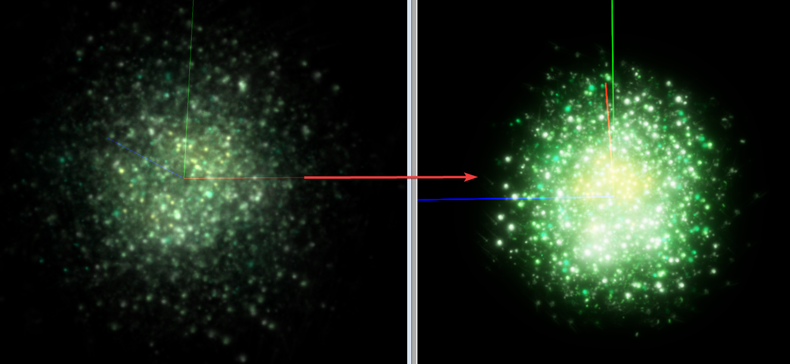

## 🌌 Particle Converter 

This program allows you to convert any Sins of a Solar Empire `.particle` into a fully compatible Sins 2 particle with a simple drag-and-drop! Also supports `.texanim`

---

## Installation

1. Clone the repository:
```bash
git clone https://github.com/largeBIGsnooze/particle-converter.git

cd particle-converter
```
2. Install the required dependencies:
```bash
python -m pip install --upgrade pip
pip install -r requirements.txt
```

## Build instructions
1. Install pyinstaller
```bash
pip install pyinstaller
```
2. Compile to binary executable
```bash
pyinstaller particle_converter.spec
```
3. You will see the executable in the dist directory as `ParticleConverter.exe`

## Usage
1. Drop any `.particle` or `.texanim` files you have onto the executable you just built.

The files are then saved to:
- `<executable>/out/effects` for `.particle` (`.particle_effect`)
- `<executable>/out/texture_animations` for `.texanim` (`.texture_animation`)

## Demo

The particles on the left are original Sins 1 effects while those on the right are their Sins 2 counterpart converted using this tool.

**Explosion Frigate - 6**
- `Explosion_Frigate6.particle`


**Explosion CapitalShip - 1**
- `Explosion_CapitalShip1.particle`


**Psi Capital Planet Bombing - Hit**
- `Weapon_PsiCapitalPlanetBombing_Hit.particle`


**Support Nanites**
- `Ability_SupportNanites.particle`



**Kultorask Nano Leech**
- `TitanAbility_NanoLeech_Self.particle`


